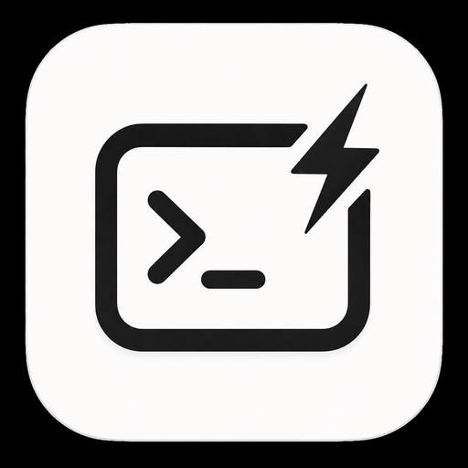
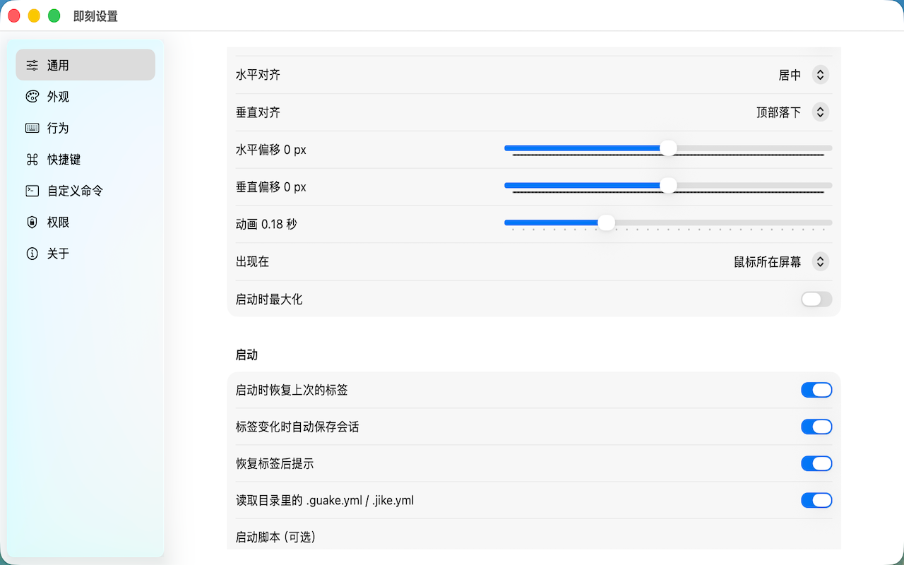
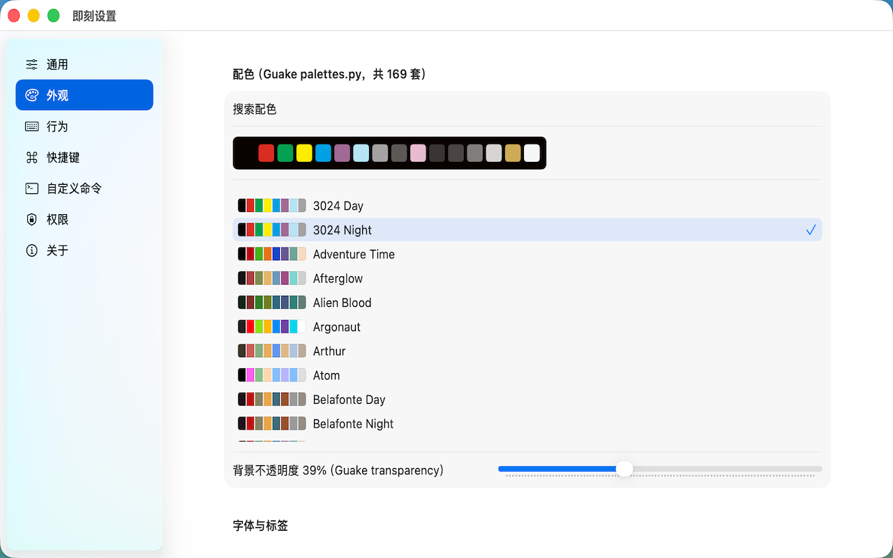
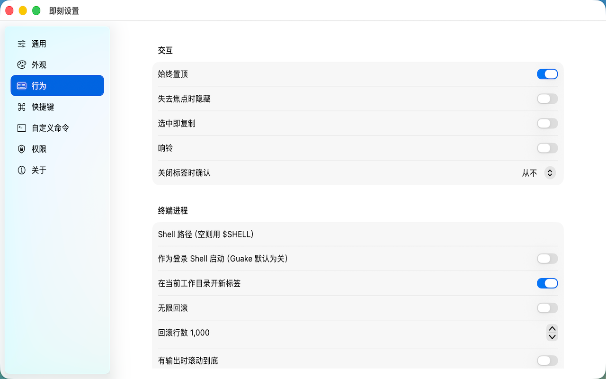
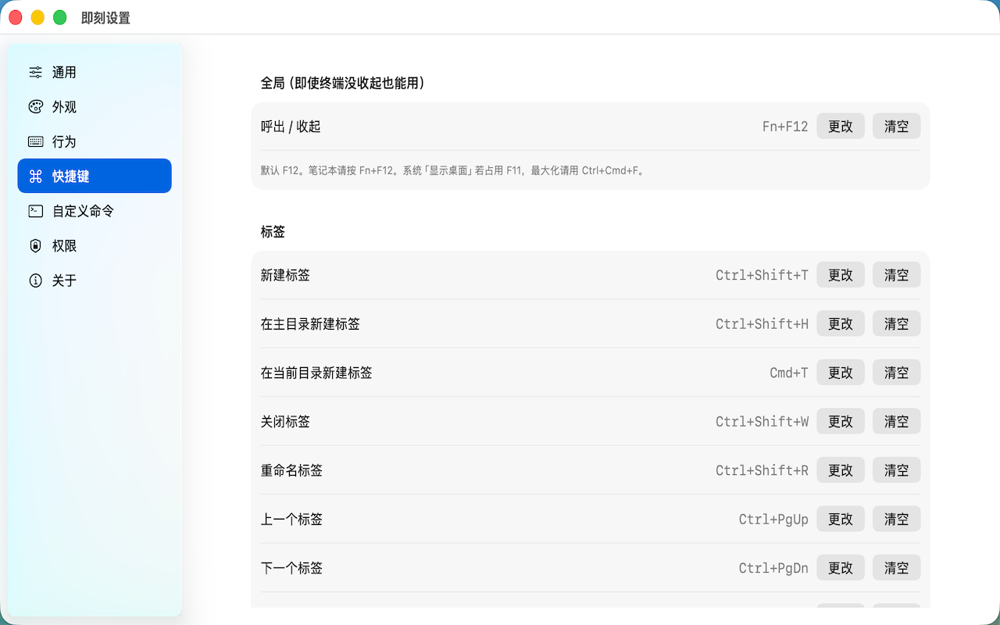
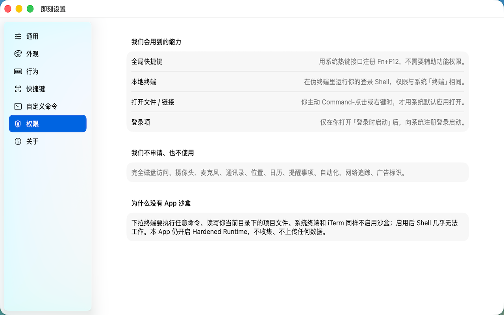
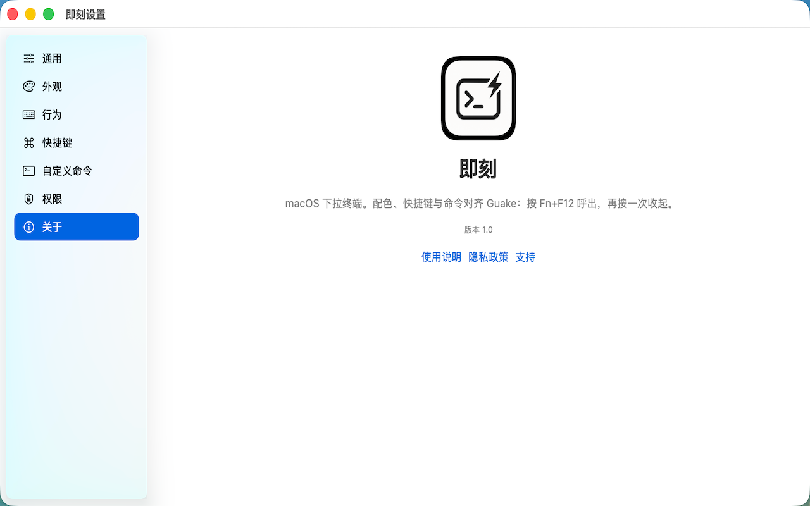
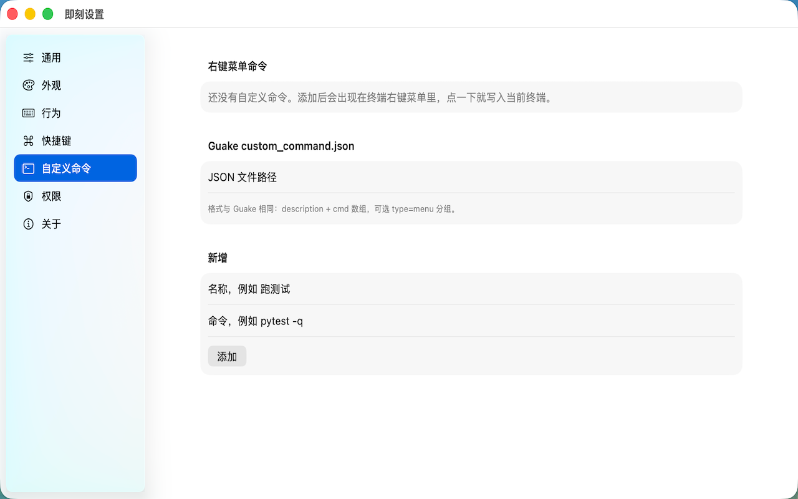

<p align="center">
  
</p>

<h1 align="center">即刻 (JiKe)</h1>

<p align="center">
  macOS 下拉终端。按 <strong>F12</strong>（笔记本 <strong>Fn+F12</strong>）从屏幕边缘滑出，再按一次收起。<br>
  配色、快捷键、Quick Open、自定义命令与 CLI 语义对齐
  <a href="https://github.com/Guake/guake">Guake</a>。
</p>

<p align="center">
  <a href="https://github.com/zhipengge/JiKe/releases/latest"></a>
  
  
  
</p>

<p align="center">
  <a href="https://github.com/zhipengge/JiKe/releases/latest">下载安装包</a>
  ·
  <a href="https://zhipengge.github.io/apps/jike/">使用说明</a>
  ·
  <a href="https://zhipengge.github.io/apps/jike/privacy.html">隐私政策</a>
  ·
  <a href="https://github.com/zhipengge/JiKe/issues">反馈</a>
</p>

<p align="center">
  
</p>

即刻在本地伪终端里跑你的登录 Shell，会话收起后继续在后台执行。不走 Mac App Store：完整本地终端需要关闭 App 沙盒（与系统「终端」、iTerm 相同），分发走 **GitHub Releases**（建议 Developer ID 签名 + 公证）。

---

## 下载安装

1. 打开 [Releases](https://github.com/zhipengge/JiKe/releases/latest)
2. 下载 `JiKe-x.y.z.zip` 或 `JiKe-x.y.z.dmg`
3. 把 **即刻** 拖进「应用程序」
4. 首次打开：若系统提示无法验证开发者，**右键 App → 打开**

最低系统：**macOS 14.0**。当前若尚未公证，Gatekeeper 会拦截一次，右键打开即可。

可选校验：

```bash
shasum -a 256 -c JiKe-x.y.z.sha256
```

### 卸载

删除「应用程序」里的即刻，可选清掉配置：

```bash
rm ~/Library/Preferences/com.gezhipeng0201.JiKe.plist
```

---

## 快速上手

1. 打开「即刻」，终端会立刻从屏幕上方滑出，光标已在输入位置
2. 笔记本按 **Fn+F12**（外接键盘可直接按 F12）呼出 / 收起
3. 菜单栏图标也可以显示或隐藏窗口
4. 标签栏右侧齿轮打开设置（或 `Cmd+,`）

| 操作 | 按键 |
|---|---|
| 呼出 / 收起 | F12（笔记本 Fn+F12） |
| 新建标签 | Ctrl+Shift+T 或 Cmd+N |
| 关闭标签 | Ctrl+Shift+W、Cmd+W，或空提示符下 Ctrl+D |
| 最大化 | Ctrl+Cmd+F 或 Cmd+Return |
| 拷贝 / 粘贴 | Cmd+C / Cmd+V（也可用 Ctrl+Shift+C / V） |
| 查找 | Cmd+F |
| 设置 | 标签栏齿轮，或 Cmd+, |
| 在访达打开当前目录 | Cmd+Shift+E |

默认快捷键与 Guake 相同（Ctrl 为主），同时补了一组 macOS 习惯键。Option **默认不当 Meta**，方便中文输入。把文件拖进终端会插入转义后的路径。

---

## 界面预览

设置按 Guake 的分组来：通用、外观、行为、快捷键、自定义命令、权限、关于。

| 通用：对齐、动画、启动恢复 | 外观：169 套 Guake 配色 |
|---|---|
|  |  |

| 行为：失焦隐藏、响铃、回滚 | 快捷键：全局热键与标签操作 |
|---|---|
|  |  |

| 权限说明（不申请无关能力） | 关于 |
|---|---|
|  |  |

自定义命令会进终端右键菜单，也兼容 Guake 的 `custom_command.json`：

<p align="center">
  
</p>

---

## 特性

- **下拉窗口**：高度、宽度、左右对齐、贴顶或贴底、透明度、动画时长都可配
- **169 套 Guake 配色**，默认为 Tango（白字黑底）；设置里可搜索切换
- **标签 + 垂直 / 水平分屏**，快捷键与 Guake 对齐
- **Quick Open**：从 `file:line`、编译器 traceback 打开源文件
- **右键菜单**：拷贝粘贴、分屏、网页搜索、自定义命令
- **目录标题**：先读 `.guake.yml`，再读 `.jike.yml`
- **`jike://` URL**：toggle / show / hide / new-tab / execute 等
- **菜单栏运行**，Dock 图标可关；支持登录时启动
- **macOS 习惯**：Cmd+C/V/A/F、拖文件插路径、访达打开当前目录
- 每个标签注入 `GUAKE_TAB_UUID`（别名 `JIKE_TAB_UUID`）
- **不收集、不上传任何数据**

---

## 目录标题

在项目根放 `.guake.yml` 或 `.jike.yml`：

```yaml
title: my-app
```

标签名优先级：你手动起的名字 → YAML 里的 `title` → 终端标题 / 目录名。

---

## `jike://` 命令行

语义对齐 Guake 的 CLI。可在脚本、Alfred、Raycast 里调用：

```bash
open 'jike://toggle'
open 'jike://show'
open 'jike://hide'
open 'jike://new-tab?path=/tmp'
open 'jike://execute?cmd=ls'
open 'jike://preferences'
open 'jike://change-palette?name=Tango'
```

也支持 `new-tab-home`、`select-tab`、`split-horizontal` / `split-vertical`、`rename-tab`、`fullscreen` 等。

---

## 常见问题

**按 F12 没反应？**  
笔记本请按 **Fn+F12**。若仍无效，到「系统设置 → 键盘 → 键盘快捷键」关掉占用 F12 的项（常见是「显示桌面」占用 F11，呼出键被改过时也检查一下）。

**快捷键怎么是 Ctrl 不是 Cmd？**  
为了和 Linux 下的 Guake 一致。新建标签是 Ctrl+Shift+T，拷贝是 Ctrl+Shift+C。Command 对应 Guake 的 Super，所以 Cmd+N / Cmd+W / Cmd+C / Cmd+V 同样可用。

**为什么没有进 Mac App Store？**  
下拉终端必须跑真实本地 Shell、读写任意目录。App Store 强制 App 沙盒，沙盒里 PTY 几乎不能用。即刻与系统终端、iTerm 一样**不启用沙盒**，只通过 GitHub Releases（建议公证）分发。

**中文输入有问题？**  
默认不把 Option 当 Meta。若你需要 Emacs 风格的 Meta，可在设置里打开。

**卸载后还留什么？**  
删掉 App，并删除 `~/Library/Preferences/com.gezhipeng0201.JiKe.plist`。

---

## 开发者

### 目录

```
JiKe/
├── JiKe/           主 App（SwiftUI 设置 + AppKit 下拉窗 + SwiftTerm）
├── Shared/         纯逻辑（逻辑测试与主 App 共用，禁 SwiftUI / SwiftTerm）
├── Config/         Info.plist（jike://）
├── LogicTests/     swiftc 逻辑测试
├── Scripts/        打包 / 发布
└── docs/images/    README 用的图标与截图
```

| 用途 | 值 |
|---|---|
| Bundle ID | `com.gezhipeng0201.JiKe` |
| 显示名 | 即刻 |
| URL scheme | `jike` |
| 最低系统 | macOS 14.0 |

硬约束（不要开沙盒、SwiftTerm 钉 1.2.x、`AppConfig` 手写 Codable 等）见 [`AGENTS.md`](./AGENTS.md)。

### 构建与测试

```bash
# Debug
xcodebuild -project JiKe.xcodeproj -scheme JiKe -configuration Debug \
  -derivedDataPath DerivedData -destination 'platform=macOS,arch=arm64' build

# 逻辑测试
./LogicTests/run.sh
```

SwiftTerm 钉在 **1.2.x**（`upToNextMinor`，实际约 1.2.5），不要升到 1.3+。

### 打安装包

```bash
./Scripts/release.sh            # 版本默认读工程 MARKETING_VERSION
./Scripts/release.sh 1.0.1      # 指定版本

# 有 Developer ID + notarytool 钥匙串配置时自动签名并公证
export SIGN_IDENTITY="Developer ID Application: Your Name (TEAMID)"
export NOTARY_PROFILE="jike-notary"
./Scripts/release.sh 1.0.0

# 打完用 gh 上传 Release
CREATE_GITHUB_RELEASE=1 ./Scripts/release.sh 1.0.0
```

产物在 `dist/`（已 gitignore，不要提交）：

| 文件 | 说明 |
|---|---|
| `JiKe-x.y.z.app` | 可直接运行的 App |
| `JiKe-x.y.z.zip` | GitHub Release 主资产 |
| `JiKe-x.y.z.dmg` | Finder 友好安装盘 |
| `JiKe-x.y.z.sha256` | 校验和（只有文件名，不含本机路径） |

只有 Apple Development 证书、没有 Developer ID 时，脚本仍会打出 ad-hoc 包，用户需「右键 → 打开」。要过 Gatekeeper 无警告，请到 [Apple Developer](https://developer.apple.com/account/resources/certificates/list) 创建 **Developer ID Application** 再公证：

```bash
xcrun notarytool store-credentials "jike-notary" \
  --apple-id "你的AppleID" \
  --team-id "7252W54VUU" \
  --password "app-specific-password"
```

### 手工验证清单

1. Fn+F12 滑出 / 再按收起
2. 菜单栏图标显示 / 隐藏
3. 换配色、透明度、字号立刻生效
4. Ctrl+Shift+T / Cmd+N 新建标签；Ctrl+D 退出 Shell 后关标签
5. `echo $GUAKE_TAB_UUID` 与 `$JIKE_TAB_UUID` 相同
6. `open 'jike://new-tab?path=/tmp'`
7. 中文路径 / `git status` 不乱码
8. Cmd+C / Cmd+V、拖文件插入路径、Cmd+Shift+E 打开访达

---

## 反馈

- Issues：[zhipengge/JiKe](https://github.com/zhipengge/JiKe/issues)（标题建议带 `[即刻]`）
- 营销页 / 隐私：[GitHub Pages · jike](https://zhipengge.github.io/apps/jike/)

许可与版权 © 2026 gezhipeng。
